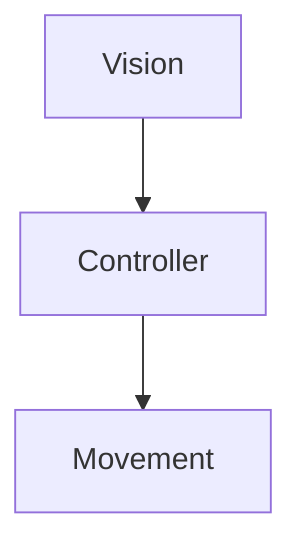

# Objective
The objective of the project is to develop the code to make a robotic arm move megablocks on a table. The main point of the task is that the positions (and in later steps the orientations) of the blocks are not known until execution, this makes a simple pre programmed motion useless. Instead, we will need to detect the type, position, and orientation of each block using a vision sensor, and then plan the motion of the robot accordingly 

The objective is split into 4 assignments.
1. There is only one block of any kind of class, in contact with the ground facing up, which has to be moved to the appropriate location
2.  There are several objects facing up which have to be moved to the appropriate locations: stacked up on each other, with blocks of the same type per stack
3. There are several objects with no orientation constraints, however the blocks can’t lean on each other, the task is the same
4.  Given a specific construction with well known design and the necessary blocks, the robot is to complete the construction

# Overview
TODO
We used ROS to send stuff between the nodes, kind of looks like this



# Perception
TODO
In order to retrieve data we used a ZED Depth-camera placed on the side of the workbench. The ZED camera sends shots which are then cropped and fed to YOLO. From the bounding-boxes around the recognized objects drawn by the model we retrieve the central pixel coordinates. With these we can get the complete coordinates of the block using the depth sensor of the camera which are then transformed into world frame coordinates.
In order to classify the blocks we opted for a machine-learning-based solution, specifically YOLO, a pre trained fast R-CNN model which is then fine-tuned on a synthetic dataset

# Controller
TODO
From block position to (X, Y, Z, r, p, y, time) to send to the robot 
Must convert frames from camera frame to robot frames
Claw machine and adapt end effector orientation to the block orientation

# Motion
## Overview
Once a motion is requested, the robot must complete it, as fast as requested and especially avoiding singularities. The node that handles the motion of the robot is implemented using a ROS action server, this was mainly so the client requesting the action could easily wait for it to complete before sending another.
## Inverse kinematics
The most important part of the motion is to find the joint values to apply to the arm in order to get the end effector to the requested position, we opted for a numerical inverse kinematics solution, this approach might be slower compared to solving it beforehand, but it's more simple and is independent of the robot, the algorithm works with any manipulator with 6 DoF out of the box and can easily be adapted to work with any number of joints[^1] 
The baseline of the algorithm for the inverse kinematics is
````
inverse_kinematics(model, target_position, target_orientation_rpy, q0){
	target_orientation = euler_to_rotation_matrix(target_orientation_rpy)
    frame_id = model.getFrameId("ee_link")

    double eps = 1e-6;
    double alpha = 1, beta = 0.5;
    int niter = 0;  // iterations so far
    int max_iter = 20;
    double lambda = 1e-8;  // damping factor
    bool out_of_workspace = false;
    bool success = false;

    while(niter < max_iter){ 
        pos_q0 = framePlacement(model, frame_id);
        jacobian = computeFrameJacobian(model, data, q0, frame_id, jacobian)
        Eigen::VectorXd e_bar_q0(model.nv);
		e_bar_q0 << target_position -pos_q0.translation(), 
			errorInSO3(pos_q0.rotation(), target_orientation)
        Eigen::VectorXd grad(model.nv);
        grad = jacobian.transpose()*e_bar_q0;
        if(grad.norm() < eps){
            success = true;
            if(e_bar_q0.norm() > 0.1){
                out_of_workspace = true;
            }
            break;
        }
        dq(model.nv);
        dq = (jacobian + lambda*Identity(6 x model.nv)).inverse()*e_bar_q0;
        Eigen::VectorXd q1(model.nv);
        niter++;
    }
	(q0, success && !out_of_workspace);
}
````

[^1] With less than 6 DoF we don't always have a solution in the workspace for 6 specified parameters, even where the end effector is dexterous
## Trajectory planning
Sending the computed joint values to the robot directly is a really bad idea. The arm moves faster the further away from the requested position it is, this means that sending a set of joint values which are far from the current ones will make the arm jerk and most likely send the real robot into protection mode because of the excessive torque requested on the motors, other than the fact that this would give us no control over the speed of the motion whatsoever.
Because of this, we need to implement some way to send the robot a lot of intermediate joint values that gradually go from the current values to the computed ones, so that the arm moves smoothly.
### Trajectory planning over the joint space
The most simple and first type of trajectory we implemented was a polynomial interpolation from the starting position to the final one, over the joint space. 
This was very fast as it required to call the inverse kinematics algorithm only once, and then compute the coefficients of a third order polynomial parameterized over time, so that with $time=0$ the joints would be at the starting position, and with $time=t_f$ the joints would be at the final one ($t_f$ is the time to complete the motion). 
We approach the problem by assuming that the arm will be not be moving at the end of the motion (we have not implemented inverse dynamics in this project so we wouldn't have a way to compute starting and end velocities anyway), the position and velocity of the i-th joint will be
$$ \begin{gather*}
q_i(t) = a_0 +a_1 t + a_2 t^2 + a_3 t^3 \\
\dot q_i(t) = a_1 + 2a_2 t + 3a_3 t^2 
\end{gather*}$$
Now we can build a system
$$
\left\{ 
    \begin{array}{l}
        q_i(0) = q_{start}&\\
        \dot q_i(0) = 0 &\\
        q_i(t_f) = q_{end} &\\
        \dot q_i(t_f) = 0
    \end{array} 
\right.
\Rightarrow
\left\{ 
    \begin{array}{l}
		a_o = q_{start} &\\
		a_1 = 0 &\\
		a_0 +a_1 t_f + a_2 t_f^2 + a_3 t_f^3 = q_{end} &\\
		a_1 + 2a_2 t_f + 3a_3 t_f^2 = 0
    \end{array} 
\right.
$$
This is a linear system, and because we have 4 variables (the $a_{i}$) and 4 equations, we will have exactly one solution, we can represent the system like so:
$$
\begin{bmatrix}
a_0 \\
a_1 \\
a_2 \\
a_3
\end{bmatrix}
\begin{bmatrix}
1 & 0 & 0 & 0 \\
0 & 1 & 0 & 0 \\
1 & t_f & t_f^2 & t_f^3 \\
0 & 1 & 2t_f & 3t_f^2
\end{bmatrix}
=
\begin{bmatrix}
q_0 \\
0 \\
q_f \\
0
\end{bmatrix}
$$
We can now easily compute the coefficients by multiplying both sides by the inverse of the 4x4 matrix, its computation should be very fast as it is full of zeroes.
Once we have the coefficients, we can put them back into the original equation and compute the evolution of the joints increasing the time by small intervals, and sending the positions to the robot.

The algorithm to compute and send a trajectory over a joint space looks like this
````
thirdOrderPolynomialTrajectory(tf, start_q, start_v=0, end_q, end_v=0){
    poly_matrix = [1,    0,    0,          0;
                   0,    1,    0,          0;
                   1,    tf,   pow(tf,2),  pow(tf, 3);
                   0,    1,    2*tf,       3*pow(tf,2)];
    poly_vector = [start_q, start_v, end_q, end_v];
    coefficients = poly_matrix.inverse()*poly_vector;
    return coefficients;
}

compute_and_send_trajectory(qi, qf, tf, freq){
    time = 0.0;
    dt = 1.0/freq;
    q = qi; // position sent so far
    c[];    // polynomial coefficients
    ros::Rate rate = ros::Rate(freq);
    while(time < tf){
        for(int jointi=0; jointi<q_size; jointi++){
            c = thirdOrderPolynomialTrajectory(tf, qi[jointi], qf[jointi]);
            q[jointi] = c[0] + c[1]*time + c[2]*pow(time,2) + c[3]*pow(time,3);
        }
        send_arm_joint_angles(q);
        time += dt;
        rate.sleep();
    }
}
````
## Singularities
After some testing using the previous algorithms, we encountered a problem: there is a singularity in the area close to where the base of the robot is attached, the area can be approximated to a cylinder, and if we try to get trough it, the robot will not be able to complete the motion in the best case, while it would crash on the table in the worst.
### Easy solution
The easiest solution was to simply draw a point in a position we know we can reach from everywhere and use that as halfway point for each motion that moves the arm from one side to the table to another, that would have however made the motion very unnatural.
### Complicated solution
Because of this we opted for a slightly more complicated but more graceful trajectory: we still have a point in the middle of the movement as checkpoint, but instead of moving there directly, we notice that we now have three non-aligned points in the space, this means we can uniquely identify an a section of a circle in the 3d space, we can then use the points on that section of a circle to draw a trajectory over the Cartesian space that doesn't have any sharp points and stays far from singularities.
As icing on the cake, we made the z coordinate of the middle point an average of the two z coordinates in order to minimize the distance traveled. The rotation of the end effector is interpolated from the beginning to the end with the help of slerp: an algorithm for spherical linear interpolation ([Slerp](https://en.wikipedia.org/wiki/Slerp)).
We expected this method to be a little slower than the joint interpolation, since we had to compute the inverse kinematics for many points, unfortunately we noticed that it was a lot slower, so slow there was no point in optimizing it either (it would take around 10 seconds to compute 6 points).
The progress on this task is on the cartesian_trajectory branch of the project
### Even easier solution
In the end, we opted for a trick that was by far the fastest: we exploited the robot's geometry by noticing that if we simply rotated the shoulder pan, we could easily get to the other side of the table and stay away from singularities, so if we detect that a motion is going to go trough the singularity in the center, we compute and send a trajectory with only the new $q_0$, and after that we send all the others

# Differences between simulation and reality
TODO position publisher

# Dependencies and third party software used
## common
+ ROS: Framework to make different software and hardware communicate in a standard way
+ Catkin: Build system for ROS applications
+ Gazebo: Simulation software integrated with ROS, this minimizes the differences between the real robot and the simulated one
+ Eigen: used in many places where computation with matrices were needed, mainly the transformation from the camera frame to the real robot and everywhere in the motion part
## vision
+ YOLO
## controller
+ non ne ho idea
## motion
+ Pinocchio: library for rigid body simulations, mainly used to pars the URDF file and compute the Jacobian of the end effector to solve the inverse kinematics algorithm
# Key performance indicators
## Recognizing the block
This Key Performance Indicator measures how long does it take for the model to recognize each block.
1. First block:
2. Second block:
3. Third block:
## Moving the block
This Key Performance Indicator measures how long it takes for the block to reach its final
position after being recognized.
1. First block: 
2. Second block: 
3. Third block:
## All together now
This Key Performance Indicator measures how long it takes for the block to reach its final
position.
1. First block: 
2. Second block: 
3. Third block:
